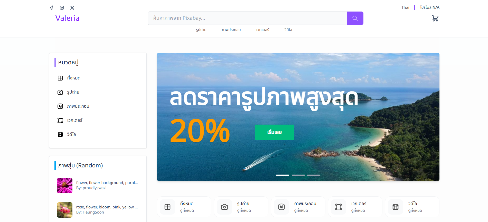

## Valeria เป็นเว็บขายภาพ (จำลอง)
    สร้างโดย JessadaId
เป็นเว็บขายภาพที่ดึงข้อมูลมาจาก pixabay (API) , โดยมีการจัด Layout การแสดงผลโดยใช้ Masonry Layout , ส่วนการยืนยันตัวตนหรือการ login ใช้ supabase auth , ตระกร้า (Cart) ใช้ LocalStorage , Qr-payment เป็น lib ในการสร้าง qr-code เพื่อการชำระเงิน (แต่ในเว็บใช้สำหรับแสดง qr-code เพื่อแสกนจ่ายไป promtpay ไม่ต้องจ่ายจริง)

## Demo
 URL : [Valeria](https://valeria-sand.vercel.app/)

## Preview

## สิ่งที่ได้
ฝึกการใช้ 
1. LocalStoreage 
2. Supabase 
3. Qr-payment 
4. Authentication-Supabase 
5. RestAPI-Pixabey 
6. Layout-MasonryGallery 
7. Floating-Alert 
8. Carosel-Autoslide
