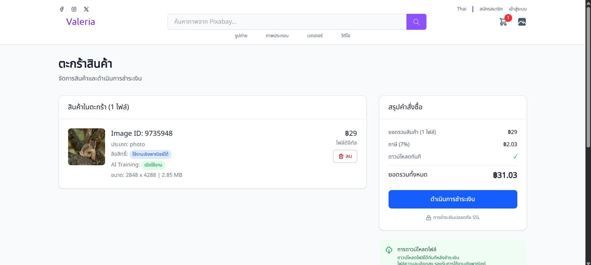
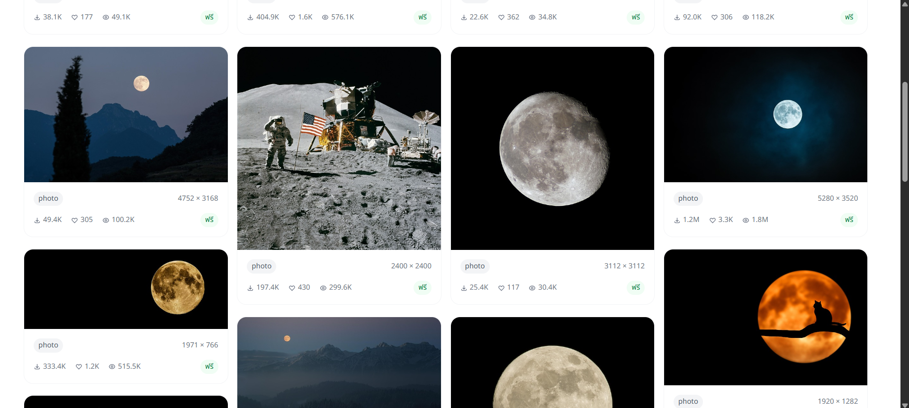
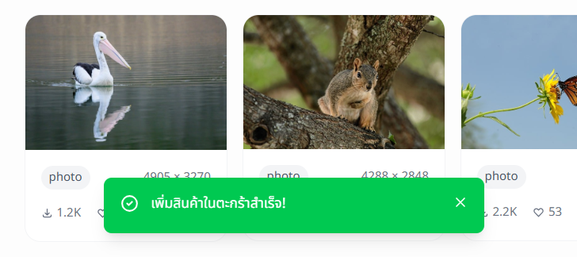

## Valeria เป็นเว็บขายภาพ (จำลอง)
    สร้างโดย JessadaId
เป็นเว็บขายภาพที่ดึงข้อมูลมาจาก pixabay (API) , โดยมีการจัด Layout การแสดงผลโดยใช้ Masonry Layout , ส่วนการยืนยันตัวตนหรือการ login ใช้ supabase auth , ตระกร้า (Cart) ใช้ LocalStorage , Qr-payment เป็น lib ในการสร้าง qr-code เพื่อการชำระเงิน (แต่ในเว็บใช้สำหรับแสดง qr-code เพื่อแสกนจ่ายไป promtpay ไม่ต้องจ่ายจริง)

## Demo
 URL : [Valeria](https://valeria-sand.vercel.app/)

## Preview

## สิ่งที่ได้
ฝึกการใช้ 
1. LocalStoreage (ใช้ในตระกร้าสินค้า)

2. Supabase 
3. Qr-payment (ใช้สำหรับจำลองการชำระเงิน promtpay)
4. Authentication-Supabase 
5. RestAPI-Pixabey (เป็น api สำหรับการดึงข้อมูลจาก pixabay)
6. Layout-MasonryGallery (เป็นการแสดงความสูงของรูปตามความเป็นจริงให้สมส่วน)

7. Floating-Alert (ใช้สำหรับการแจ้งเตือน เป็น pop up ขึ้นมาด้านล่างของหน้าจอ)

8. Carosel-Autoslide (แสดงผลหน้าหลักของเว็บไซต์)

