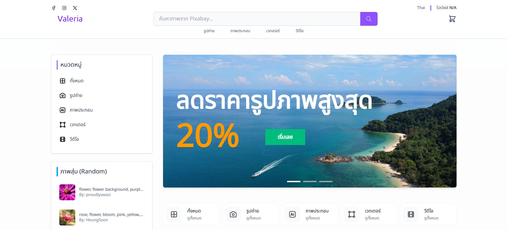
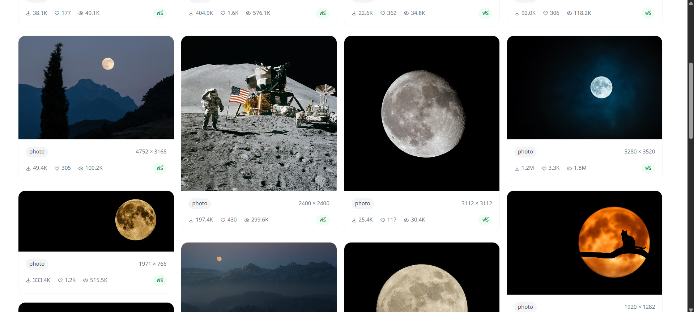
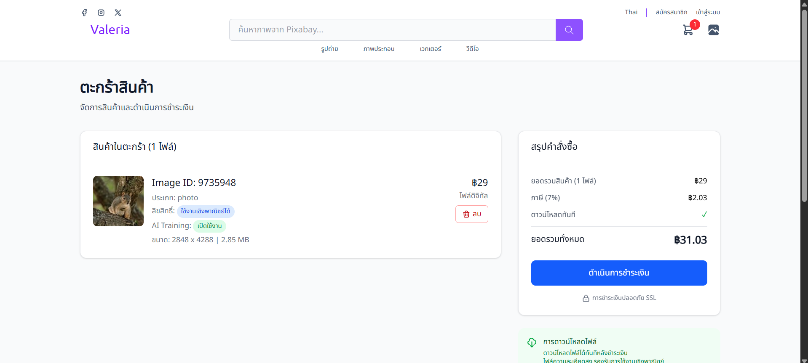

# Valeria — Simulated Stock Photo Marketplace

> A simulated e-commerce platform for browsing and purchasing stock photography, built with SvelteKit and integrated with third-party APIs and authentication services.

**Author:** JessadaID &nbsp;|&nbsp; **Live Demo:** [valeria-sand.vercel.app](https://valeria-sand.vercel.app/)

---

## Overview

Valeria is a front-end focused project that simulates a stock photo marketplace. Users can browse high-quality images fetched from the **Pixabay API**, add items to a shopping cart, authenticate securely, and simulate a payment flow using a PromptPay QR code — all without real transactions.

The project was developed to deepen practical skills in modern front-end technologies, third-party service integration, and responsive UI design.

---

## Preview



---

## Tech Stack

| Category | Technology |
|---|---|
| Framework | SvelteKit 2 |
| Language | JavaScript / TypeScript |
| Styling | Tailwind CSS v4 |
| Authentication | Supabase Auth |
| Database / BaaS | Supabase (PostgreSQL) |
| External API | Pixabay REST API |
| Payment Simulation | promptpay-qr / qrcode |
| Carousel | Embla Carousel |
| Build Tool | Vite 6 |
| Deployment | Vercel |

---

## Key Features

### 🖼️ Masonry Gallery Layout
Images are displayed using a **Masonry Layout**, preserving each photo's natural aspect ratio for a visually balanced and professional browsing experience.



### 🛒 Shopping Cart (LocalStorage)
Cart state is persisted via **LocalStorage**, allowing users to retain their selections across page refreshes without requiring a backend session.



### 🔐 Authentication
User sign-in and session management are handled by **Supabase Auth**, providing secure and scalable identity management out of the box.

### 💳 Payment Simulation (PromptPay QR)
At checkout, a **PromptPay QR code** is dynamically generated using the `promptpay-qr` library. This simulates a real payment flow without processing any actual transactions.

### 🔔 Floating Alert Notifications
A custom **floating alert system** displays contextual feedback messages as pop-ups at the bottom of the screen, improving the overall user experience.


### 🎠 Auto-Slide Carousel
The homepage features an **auto-sliding carousel** powered by Embla Carousel, providing an engaging and modern landing experience.

---

## Skills Demonstrated

This project was built to practice and demonstrate the following competencies:

- Consuming and integrating a **REST API** (Pixabay)
- Implementing **BaaS authentication** with Supabase
- Managing client-side state with **LocalStorage**
- Building dynamic, responsive **UI layouts** (Masonry Grid)
- Generating and rendering **QR codes** for payment simulation
- Deploying a production-ready application on **Vercel**

---

## Getting Started

```bash
# Install dependencies
npm install

# Run development server
npm run dev

# Build for production
npm run build
```

---

## License

This project is for **portfolio and demonstration purposes only**. All images are sourced from the [Pixabay API](https://pixabay.com/api/docs/) under their respective licenses.
